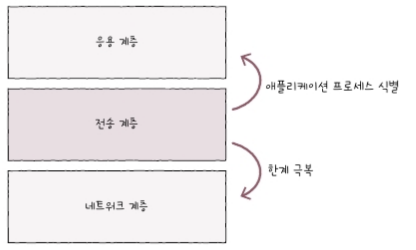

# 04. 전송계층

### <mark style="color:blue;">04-1 전송 계층 개요: IP의 한계와 포트</mark>

네트워크 계층의 IP는 **신뢰할 수 없는 통신**과 **비연결형 통신**을 수행한다는 한계가 있음

**전송 계층**은 **신뢰할 수 있는 통신**과 **연결형 통신**을 가능하게 하여 이러한 IP의 한계를 극복하고, **포트 번호**를 통해 **응용 계층의 애플리케이션 프로세스들을 식별**하는 역할을 수행함.

#### ⭐ 신뢰할 수 없는 통신과 비연결형 통신

* **신뢰할 수 없는 통신**
  * IP 프로토콜은 패킷이 수신지까지 제대로 전송되었다는 보장을 하지 않는다.
  * **최선형 전달(best effort delivery)**
    *   **‘최선을 다해 보겠지만, 전송 결과에 대해서는 어떠한 보장도 하지 않겠다’**&#xB77C;는 것을 의미한다.

        
* **비연결형 통신**
  * 송수신 호스트 간에 사전 연결 수립 작업을 거치지 않고, 그저 수신지를 향해 패킷을 보내기만 함.

***

📌 **IP가 어떠한 보장도 없이 신뢰할 수 없는, 비연결형 통신을 하는 이유는 성능 때문!**

* 연결을 수립하고 패킷이 제대로 전송되었는지 확인하는 작업은 **더 많은 시간, 대역폭, 부하가 요구**되고, 이는 곧 **성능상 악영향으로 이어질 수 있음.**

#### ⭐ IP의 한계를 보완하는 전송 계층

**1️⃣ 전송 계층은 연결형 통신을 가능하게 한다.**

* 대표적은 전송 프로토콜로 **TCP**가 있음.
*   두 호스트가 정보를 주고받기 전에 마치 가상의 회선을 설정하듯이 연결을 수립한다.

    

**2️⃣ 전송 계층은 신뢰성 있는 통신을 가능하게 한다.**

* 이 또한 **TCP**를 통해 가능함.
* **TCP**는 패킷이 수신지까지 **올바른 순서대로 확실히 전달되는 것을 보장하기 위해** 재전송을 통한 **오류 제어, 흐름 제어, 혼잡 제어** 등 **다양한 기능들을 제공**함.

***

📌 연결형 통신과 신뢰성 있는 통신이 그렇지 않은 통신에 비해 **무조건 좋은 것만은 아님!**

*   높은 성능을 위해 신뢰할 수 없는 통신, 비연결형 통신을 지원하는 **UDP**가 있음. **TCP보다는 비교적 빠름.**

    

#### ⭐ 응용 계층과의 연결 다리, 포트

*   **포트의 정의**

    * 패킷은 **실행 중인 특정 애플리케이션 프로세스까지 전달되어야 함.**
      *   패킷의 **최종 수신 대상**은 **특정 애플리케이션 프로세스!**

          
    * 패킷이 실행 중인 특정 애플리켕션까지 전달되려면 **특정 애플리케이션을 식별할 수 있는 정보**가 포함되어 있어야 함. 이 정보를 **포트(port)**&#xB77C;고 함.
    * **포트(port)**&#xB780; **응용 계층의 애플리케이션 프로세스를 식별하는 정보!**

* **포트의 분류**
  * **포트 번호**를 통해 **특정 애플리케이션을 식별**함
    * 패킷 내 **수신지 포트**와 **송신지 포트**를 통해 **송수신지 호스트의 애플리케이션을 식별**함.
  * TCP와 UDP 모두 포트 번호 필드인 송수신지 포트 번호를 포함함.
  * 포트 번호는 16bit로 표현 가능하며, 사용 가능한 포트의 수는 2^16개.
  *   0 \~ 65535까지의 포트 번호는 범위에 따라 세 종류로 나뉨.

      * **잘 알려진 포트(well known port)**
      * **등록된 포트(registered port)**
      *   **동적 포트(dynamic port)**

          

      ✅ **잘 알려진 포트(well known port)**

      

      * 0 \~ 1023번 까지의 포트로, **범용적으로 사용되는 애플리케이션 프로토콜이 일반적으로 사용**하는 널리 알려진, 유명한 포트 번호를 의미.

      ✅ **등록된 포트(registered port)**

      

      * 1024 \~ 49151번까지는 등록된 포트로, 덜 범용적이지만 흔히 사용되는 애플리켕션 프로토콜에 할당하기 위해 사용&#xB428;**(암기x)**

      ✅ **동적 포트(dynamic port)**

      * 49152 \~ 65535번까지의 포트로, 특별히 관리되지 않는 자유롭게 사용하게 사용할 수 있는 포트.
  * **서버**로 동작하는 프로그램은 일반적으로 **잘 알려진 포트**와 **등록된 포트**로 동작하는 경우가 많음.
  *   반면 **클라이언트**로서 동작하는 프로그램은 **동적 포트 번호 중에서 임의의 번호**가 할당되는 경우가 많음.

      
  * **IP 주소와 포트 번호**에 대한 정보가 주어지면 **특정 호스트에서 실행 중인 특정 애플리케이션 프로세스**를 식별할 수 있음
    *   일반적으로 **IP 주소:포트 번호** 형식으로 표기되는 경우가 많음

        

***

📌 **전송 계층**은 **신뢰할 수 있는 연결형 통신이 가능한 프로토콜(TCP)를 제공**하기에 **네트워크 계층의 한계를 보완**할 수 있고, **포트를 통해 응용 계층의 애플리케이션을 식별**함으로써 **응용 계층과의 연결 다리 역할을 수행**함.

#### ⭐ 포트 기반 NAT

*   **NAT**

    * **IP 주소를 변환하는 기술**이며, 주로 **네트워크 내부에서 사용되는 사설 IP 주소와 네트워크 외부에서 사용되는 공인 IP 주소를 변환**하는 데 사용됨.

*   **NAT 변환 테이블**

    

    * 변환의 대상이 되는 IP 주소 쌍이 명시되어 있음
    * 변환의 대상이 되는 IP 주소가 일대일로 대응되어 있어 **이 방식만으로는 많은 사설 IP 주소를 변환하기에는 무리**가 있음. 이를 해결하기 위해 **포트가 활용**됨

*   **NAPT(Network Address Port Translation)**

    

    * **포트 기반의 NAT**를 **NAPT**라 함. (APT라 부르기도 함)
    * **하나의 공인 IP 주소를 여러 사설 IP 주소가 공유할 수 있도록 하는 NAT의 일종**임.
    * NAT 테이블에 변환할 IP 주소 쌍과 더불어 **포트 번호도 함께 기록**하고 변환함.
    * 네트워크 외부에서 사용할 IP 주소가 같더라도 **포트 번호가 다르면 네트워크 내부의 호스트를 특정할 수 있기에 다수의 사설 IP 주소를 그보다 적은 수의 공인 IP 주소로 변환**가능.
    * **NAPT**를 사용하면 **내부 IP 주소와 외부 IP 주소를 N:1로 관리**할 수 있고, 이러한 점에서 **공인 IP 주소 수 부족 문제를 개선한 기술**로도 간주됨.


#### 💡참조 1. 포트 포워딩

네트워크 내 특정 호스트에 **IP 주소와 포트 번호를 미리 할당**하고, 해당 **IP 주소:포트 번호로써 해당 호스트에게 패킷을 전달**하는 기능

특정 IP 주소와 포트 번호 쌍을 특정 호스트에게 할당한 뒤, **외부에서 통신을 시작할 호스트에게 해당 접속 정보를 알려줌.**

주로 **네트워크 외부에서 네트워크 내부로 통신을 시작할 때**, 네트워크 내부의 서버를 외부에서 접속할 수 있도록 **접속 정보를 공개하기 위해 자주 사용**됨.

*

    <figure><figcaption></figcaption></figure>

**‘어떤 공인 IP 주소:외부 접속 포트(서비스 포트)’**&#xC5D0; 접근했을 때 어떤 **‘사설 IP 주소:내부 전달 포트’**&#xB85C; 전달할지를 설정하는 화면.

**공인 IP 주소:1234**로 전송한 패킷은 **192.168.100.100:1025**로 전달되는 셈.



#### 💡참조 2. ICMP(Internet Control Message Protocol)

**IP**의 **신뢰할 수 없는 전송 특성과** **비연결형 전송 특성**을 **보완하기 위한 네트워크 계층의 프로토콜.**

**IP 패킷**의 **전송 과정에 대한 피드백 메시지(ICMP 메시지)를 얻기 위해 사용되는 프로토콜**

*

    <figure><figcaption></figcaption></figure>

예를 들어 라우터에게 전달된 패킷의 **TTL 필드가 0이 되면** 해당 라우터는 송신지 호스트에게 **\[시간 초과 타입 - TTL 만료 코드] ICMP 패킷을 전송**하게 됨

**경로를 찾을 수 없을 때**는 **\[수신지 도달 불가 타입 - 네트워크 도달 불가 코드]** ICMP 패킷을 전송.

*

    <figure><figcaption></figcaption></figure>

아래 표는 **네트워크상의 정보 제공**을 위한 대표적인 **ICMP 메시지**

*

    <figure><figcaption></figcaption></figure>

이러한 메시지들은 **네트워크상의 간단한 문제 진단 및 테스트를 위해 사용**됨

**traceroute, tracert** 명령어는 **ICMP 메시지를 기반으로 동작**함

**ping**명령어도 **ICMP기반의 명령어로, ICMP의 에코 요청, 에코 응답 메시지를 기반으로 구현**되어 있음.

📌 **ICMP는 IP의 신뢰성을 보장하는것이 아닌,** 신뢰할 수 없는 특성을 보완하기 위한 **‘도우미’역할**을 할 뿐임.

**신뢰성을 완전히 보장하기 위해서는 전송 계층의 프로토콜이 필요**함


***

### <mark style="color:blue;">04-2 TCP와 UDP</mark>

#### ⭐ TCP 통신 단계와 세그먼트 구조

*   **TCP**

    

    * 통신(데이터 송수신)하기 전에 **연결을 수립**하고 통신이 끝나면 **연결을 종료**함
    * 데이터 송수신 과정에서 재전송을 통한 **오류 제어, 흐름 제어, 혼잡 제어** 등의 기능을 제공
    *   **MSS(Maximun Segment Size)**

        

        * **TCP로 전송할 수 잇는 최대 페이로드 크기**
        *   TCP 헤더 크기는 제외

            * MTU는 헤더의 크기까지 포함함.

*   **TCP 세그먼트 구조**

    

    * **송수신지 포트(Source port, Destination Port)**
    * **순서 번호(Sequence number)**
      * 세그먼트의 올바른 순서를 보장하기 위한 번호
    * **확인 응답 번호(Acknowledgement number)**
      * 상대 호스트가 보낸 세그먼트에 대한 응답으로, 다음으로 수신하기를 기대하는 순서 번호
    * **제어 비트(Control bits),** 플래그 비트(Flag bits)라고 불리기도 함.
      * 현제 세그먼트에 대한 부가 정보
    *   **윈도우(Window)**

        * 수신 윈도우의 크기로, 한 번에 수신하고자 하는 데이터의 양을 나타냄

*   **제어 비트**

    * 기본적으로 8bit로 구성되고, 가장 자주 언급되는 세 개의 제어 비트는,
      * **ACK:** 세그먼트의 승인을 나타내기 위한 비트
      * **SYN:** 연결을 수립하기 위한 비트
      * **FIN:** 연결을 종료하기 위한 비트
    * **‘ACK(다른 제어 비트도 가능) 비트가 1로 설정된 세그먼트’**&#xB294; 편의상 **’ACK 세그먼트’**&#xB85C; 불림.

* **순서 번호와 확인 응답 번호**
  * TCP의 신뢰성을 보장하기 위해 사용되는 중요한 필드
  * **순서 번호**
    * 세그먼트의 올바른 순서를 보장하기 위한 번호
    *   MSS가 500바이트라고 했을 때, 네 개의 세그먼트로 쪼갤 수 있음.

        
    * **처음 통신을 위해 연결을 수립한 경우,** 즉 제어 비트에서 연결을 수립하기 위한 비트인 SYN 플래그가 1로 설정된 세그먼트의 경우 순서 번호는 무작위 값이 됨.
    * 이를 **초기 순서 번호(ISN: Initial Sequence Number)**&#xB77C;고 하고, 아래는 100인 예시.
    *   **연결 수립 이후 순서 번호**는 **초기 순서 번호 + 송신한 바이트 수**가 됨

        
  *   **확인 응답 번호**

      

      * **순서 번호에 대한 응답**으로, **‘다음에는 이걸 보내 주세요’, ‘다음으로 제가 받을 순서 번호는 이것입니다’**&#xB97C; 나타내는 값.
      * **수신자가 다음으로 받기를 기대하는 순서 번호**로, 일반적으로 **‘수신한 순서 번호 + 1’**&#xB85C; 설정됨.
      * **ACK 플래그를 1로 설정**해야함.

#### ⭐ TCP 연결 수립과 종료

*   **연결 수립: 3-way-handshake**

    

    

    * **Active open**
      * **처음 연결을 시작하는 호스트의 연결 수립 과정**
      * 주로 클라이언트에서 수행됨
    *   **Passive open**

        * **연결 요청을 받고 나서** **요청에 따라 연결을 수립해 주는 호스트의 연결 수립 과정**
        * 주로 서버에서 수행됨

*   **연결 종료: 4-way-handshake**

    

    

    * **Active close**
      * 먼저 연결을 종료하려는 호스트
    * **Passive close**
      * 연결 종료 요청을 받아들이는 호스트

#### ⭐ TCP 상태

* **TCP 상태(State)**
  * TCP는 연결형 통신과 신뢰할 수 있는 통신을 유지하기 위해 다양한 **‘상태’**&#xB97C; 유지함
    * **‘상태’**&#xB294; 현재 어떤 통신 과정에 있는지를 나타내는 정보
  * TCP는 상태를 유지하고 활용한다는 점에서 **Stateful Protocol**이라고도 부름
  *   3가지 상태로 나누어 생각해 볼 수 있음.

      1️⃣ **연결이 수립되지 않은 상태**

      **2️⃣ 연결 수립 과정에서 주로 볼 수 있는 상태**

      **3️⃣ 연결 종료 과정에서 주로 볼 수 있는 상태**

      

1️⃣ **연결이 수립되지 않은 상태**

*   아직 연결 수립이 이루어지기 전의 호스트는 주로 **CLOSED**나 **LISTEN**상태를 유지하고 있음

    

    * **CLOSED**
      * 아무런 연결이 없는 상태
    *   **LISTEN**

        * 연결 대기 상태로, SYN 세그먼트를 기다리는 상태
        * 클라이언트가 서버에게 SYN 세그먼트를 보내면 3-way-handshake가 시작됨

**2️⃣ 연결 수립 상태**

*   주로 **SYN-SENT, SYN\_RECEIVED, ESTABLISHED** 상태를 볼 수 있음

    

    * **SYN-SENT**
      * SYN 세그먼트를 보낸 뒤 SYN + ACK 세그먼트를 기다리는 상태
      * 연결 요청을 보낸 뒤 대기하는 상태
    * **SYN-RECEIVED**
      * SYN + ACK 세그먼트를 보낸 뒤 ACK 세그먼트를 기다리는 상태
    *   **ESTABLISHED**

        * 연결이 확립되었음을 나타내는 상태로, 데이터를 송수신할 수 있는 상태를 의미함.
        * 두 호스트가 마지막 ACH 세그먼트를 주고받으면 ESTABLISHED상태로 접어들게 됨

**3️⃣ 연결 종료 상태**

*   TCP 연결을 종료하는 과정에서 주로 **FIN-WAIT-1, CLOSE-WAIT, FIN-WAIT-2, LAST-ACK, TIME-WAIT, CLOSED** 상태를 볼 수 있음

    

    * **FIN-WAIT-1**
      * 연결 종료의 첫 단계
      * FIN 세그먼트로서 연결 종료 요청을 보낸 active close 호스트는 FIN-WAIT-1상태로 접어듬.
    * **CLOSE-WAIT**
      * 종료 요청인 FIN 세그먼트를 받은 passive close 호스트가 그에 대한 응답으로 ACK 세그먼트를 보낸 후 대기하는 상태
    * **FIN-WAIT-2**
      * FIN-WAIT-1 상태에서 ACK 세그먼트를 받게 되면 FIN-WAIT-2 상태가 됨.
      * 상대 호스트의 FIN 세그먼트를 기다리는 상태
    * **LAST-ACK**
      * CLOSE-WAIT 상태에서 FIN 세그먼트를 전송한 뒤 이에 대한 ACK 세그먼트를 기다리는 상태
    * **TIME-WAIT**
      * active close 호스트가 FIN 세그먼트를 수신한 뒤, 이에 대한 ACK 세그먼트를 전송한 뒤 접어드는 상태
      * passive close 호스트가 마지막 ACK 세그먼트를 수신하면 CLOSED 상태로 전이하는 반면, TIME-WAIT 상태에 접어든 액티브 클로즈 호스트는 **일정 시간을 기다린 뒤 CLOSED 상태로 전이**
      * **TIME-WAIT가 필요한 이유?**
        * 가장 주요한 이유는 상대 호스트가 받았어야 할 마지막 ACK 세그먼트가 올바르게 전송되지 않았을 수 있기 때문.
    * **CLOSING**
      * 보통 동시에 연결을 종료하려 할 때 전이되는 상태
      *   서로의 종료 응답을 기다리는 경우 CLOSEING상태로 접어드는 셈이며, 이 경우 ACK 세그먼트를 수신한다면 각자 TIME-WAIT 상태로 접어든 두 종료하게 됨.

          

*   TCP 상태를 종합해서 그림으로 정리한 그림

    

#### ⭐ **UDP 데이터그램 구조**

* **UDP**
  * TCP와 달리 비연결형 통신을 수행하는 신뢰할 수 없는 프로토콜
  * 연결 수립 및 해제, 재전송을 통한 오류 제어, 혼잡 제어, 흐름 제어 등을 수행하지 않고, 상태를 유지하지도 않음.
  * stateless프로토콜의 일종
  *   **UDP 데이터그램 구조**

      

      * **체크섬**은 데이터그램이 훼손되었는지를 나타내는 정보라서 **신뢰성/비신뢰성과는 관련이 없음.**
  * UDP는 TCP에 비해 적은 오버헤드로 패킷을 빠르게 처리 가능.
    * 실시간 스트리밍 서비스, 인터넷 전화처럼 실시간성이 강조되는 상횡에서 TCP보다 더 많이 쓰임

📌 **TCP**는 **‘하나씩 확실하게 전달하는 것’**&#xACFC; 같다면, **UDP**는 **‘수신지에 패킷들을 빠르게 마구 던지는 것’**&#xACFC; 같음. 그 과정에서 패킷이 손실되거나 패킷의 순서가 바뀔 수도 있음.



**TCP**




**UDP**




***

### <mark style="color:blue;">**04-3 TCP의 오류·흐름·혼잡 제어**</mark>

**TCP**는 **재전송 기반**의 **오류 제어, 흐름 제어, 혼잡 제어를 수행**함.

#### ⭐ **오류 제어: 재전송 기법**

*   **오류 검출과 재전송**

    * **체크섬**은 **세그먼트의 훼손 여부만 나타낼 뿐**이고, 체크섬 값이 잘못되었다면 해당 패킷을 읽지 않고 폐기하기에 이것만으로 **신뢰성을 보장하기는 부족**함.
    * 신뢰성을 제대로 보장하려면,
      * **송신 호스트가 송신한** **세그먼트에 문제가 발생했음을 인지할 수 있어야 하고,**
      * **오류를 감지하게 되면**(세그먼트가 잘못 전송되었음을 알게 되면) **해당 세그먼트를 재전송할 수 있어야 함.**
    *   TCP가 오류를 검출하고 세그먼트를 재전송하는 상황에는 두 가지가 있음.

        1️⃣ **중복된 세그먼트를 수신했을 때**

        2️⃣ **타임아웃이 발생했을 때**

**1️⃣ 첫째, 중복된 ACK 세그먼트를 수신했을 때**

* 세그먼트의 순서 번호 중에서 일부가 누락되면 중복된 ACK 세그먼트를 전송하게 됨
*   호스트 B가 N+2번을 받아도 N+1 ACK을 보내면서 중복이 발생함.

    


💡**RTT(Rount Trip Time)**

* **메시지를 전송한 뒤 그에 대한 답변을 받을 때까지 걸리는 시간**을 RTT라고 함.



2️⃣ **둘째, 타임아웃이 발생했을 때**

* TCP 세그먼트를 송신하는 호스트는 모두 **재전송 타이머(retransmission timer)**&#xB77C;는 값을 유지함
* 호스트가 전송할 때 마다 재전송 타이머를 시작하고, 이 카운트다운이 끝난 상황을 **Timeout**이라 함.
*   Timeout이 발생할때 까지 ACK 세그먼트를 못받으면 세그먼트를 재전송함.

    
* **ARQ(Automatic Repeat Request): 재전송 기법**
  * **Stop-and-Wait ARQ, Go-Back-N ARQ, Selective Repeat ARQ**가 있음
  * **Stop-and-WAIT ARQ**
    * 제대로 전달했음을 확인하기 전까지는 새로운 메시지를 보내지 않는 방식
    *   전송되었음을 확인해야만 다음 전송을 시작할 수 있기에, 네트워크의 이용 효율이 낮아질 수 있음.

        
  * **Go-Back-N ARQ**
    * 연속해서 메시지를 전송할 수 있는 기술인 **파이프라이닝(Pipelining)**&#xC744; 이용함.
    * 도중에 잘못 전송된 세그먼트가 발생할 경우 해당 세그먼트부터 전부 다시 전송함.
    *   n번에 대한 ACK 세그먼트는 **‘n번만’**&#xC758; 확인 응답이 아닌, **‘n번까지’**&#xC758; 확인 응답이라고 볼 수 있으며, 이를 **누적 확인 응답(Cumulative ACK)**&#xC774;라 함.

        
  *   **Selective Repeat ARQ**

      * Go-Back-N ARQ의 한 세그먼트에 문제가 발생했을때 그 후의 모든 세그먼트를 다시 재전송해야한다는 단점을 보완할 수 있음.
      * 수신 호스트 측에서 제대로 전송받은 각각의 패킷들에 대해 ACK 세그먼트를 보내는 방식으로, **개별 확인 응답(Selective ACK)**&#xC784;.
      *   응답받지 못한 세그먼트가 존재하면 해당 세그먼트를 재전송함.

          
      * 오늘날의 대부분의 호스트는 TCP 통신에서 **Selective Repeat ARQ를 지원**함. (지원 안하면 Go-Back-N ARQ)


#### 💡**빠른 재전송(fast retransmit)**

* 타이머가 만료되기 전이라도 세 번의 동일한 ACK 세그먼트가 수신되었다면 해당 세그먼트를 곧바로 재전송하는 기능
* 타이머가 끝날 때까지 기다리는 시간을 줄일 수 있음.
* **시간 낭비를 줄이며 빠르게 손실된 세그먼트를 재전송함으로써 성능을 높이는 기법**



#### ⭐ **흐름 제어: 슬라이딩 윈도우**

* **흐름 제어(flow control)**
  * **수신자의 처리 속도를 고려하여 전송하는 방식**
  * 호스트가 한 번에 받아서 처리할 수 있는 세그먼트의 양에는 한계 있음.
  *   **수신 버퍼**

      * 수신된 세그먼트가 애플리케이션 프로세스에 의해 읽히기 전에 임시로 저장되는 공간
      * 버퍼의 크기보다 많은 데이터를 전송하면 일부 세그먼트가 처리되지 못할 수 있음.
      * 버퍼가 넘치는 문제 상황을 **버퍼 오버플로(buffer oveflow)**&#xB77C; 함.

* **슬라이딩 윈도우**
  * **윈도우**
    * **송신 호스트가 파이프라이닝할 수 있는 최대량**
    * TCP 헤더에 버퍼 크기를 전달하면서 동적으로 조절 가능
    *   윈도우의 크기만큼 확인 응답을 받지 않고도 한 번에 전송 가능함

        
    *   위 그림에서 네 번째 ACK을 받으면 한칸 오른쪽으로 움직임

        

#### ⭐ **혼잡 제어**

네트워크의 혼잡도를 판단하고 혼잡한 정도에 따라 전송량을 조절하는 방식으로, 느린 시작, 혼잡 회피, 빠른 회복등의 알고리즘이 사용될 수 있습니다.

*   **혼잡(Congestion)**

    * 모든 호스트가 같은 라우터에게 전송 가능한 최대의 양으로 세그먼트를 전송하면 라우터에 과부하가 생겨 모든 정보를 한 번에 처리하지 못할 수 있음.
    * 그럼 호스트들은 오류를 검출하여 재전송을 하게 되고, 그럴 수록 혼잡 현상이 점점 악화됨

* **혼잡 제어(Congestion control)**
  * 흐름 제어의 주체가 수신 호스트라면 **혼잡 제어의 주체**는 **송신 호스트**
  * 네트워크 혼잡도를 판단하고 유동적으로 전송량을 조절
  *   **혼잡 윈도우(Congestion Window)**

      * 혼잡 없이 전송할 수 있을 법한 데이터양
      * 송신자가 자체적으로 계산하여 유지할 정보임으로 헤더에 포함할 필요가 없음.

* **혼잡 제어 알고리즘(Congestion control algorithm)**
  * **AIMD(Additive Increase/Multiplicative Decrease)**
    * RTT마다 1씩 선형적으로 증가시키고 혼잡이 감지되면 절반으로 떨어뜨림
    * 이것만으로는 잘 안됨
      * 이와 관련하여 더 정교한 알고리즘으로 **느린 시작, 혼잡 회피, 빠른 회복** 알고리즘이 있음.
  * **느린 시작 알고리즘**
    * 1부터 시작해서 문제없이 수신된 **ACK 세그먼트 하나당 1씩** 증가시킴 **(2배씩 지수적으로 증가)**
    * **느린 시작 임계치**
      *   점점 증가하다가 **임계치 이상**이 되거나, **타임아웃이 발생**하거나, **세 번의 중복된 ACK 세그먼트**가 발생하면 다음 방법을 선택함.

          

          * ‼️ **혼잡 윈도우 ≥ 느린 시작 임계치 상황에서 혼잡 윈도우를 절반으로 초기화 하지 않음!!**
  * **혼잡 회피 알고리즘**
    * **윈도우 크기를 선형적으로 증가.**
    * 느린 시작 임계치를 넘어신 시점부터는 혼잡이 발생할 우려가 있으니 조심해서 증가시키는 방식
  * **빠른 회복 알고리즘**
    * **세 번의 중복된 ACK 세그먼트를 수신하면 빠른 재전송과 더불어 빠른 회복 알고리즘이 수행**됨
    * **느린 시작은 건너뛰고 혼잡 회피를 수행**
  *   **예시**

      


#### 💡**참조 1. ENC: 명시적 혼잡 알림**

최근 혼잡을 회피하기 위해 네트워크 중간 장치(주로 라우터)의 도움을 받는 방법이 생겼는데, 이를 **명시적 혼잡 알림(ENC: Explicit Congestion Notification)**&#xC774;라 함.

**IP(IPv4)**

**TCP/IP**

1. **A → B 를 위해 라우터에게 메시지를 보냄**
2. **라우터 입장해서 혼잡해질 것 같다고 판단하면 ENC 비트를 설정한 후 전달**
3. **B에 혼잡 표시가 되어 있다면 ECE 비트를 세팅을 통해 네트워크가 혼잡함을 알려줌**
4. **송신 호스트가 응답받은 세그먼트에서 ECE 비트가 설정되어 있을 경우 송신 호스트는 CWR 비트를 세팅 후 혼잡 윈도우를 반으로 줄임**
5.

    <figure><figcaption></figcaption></figure>


***

